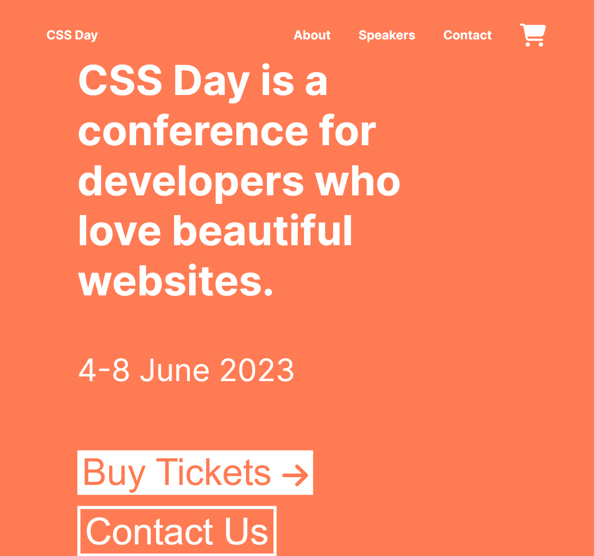
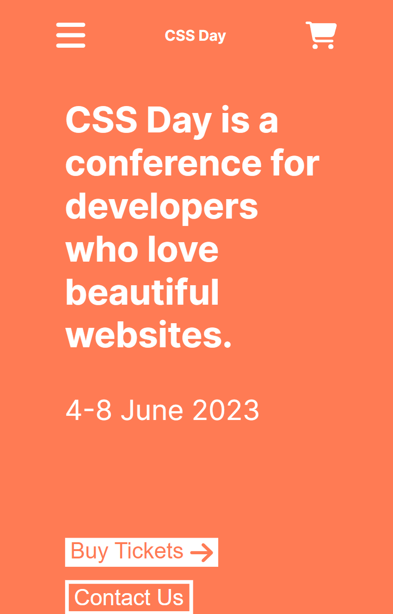
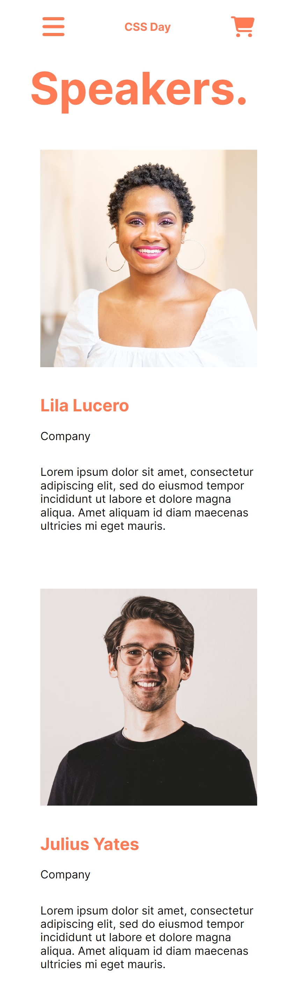
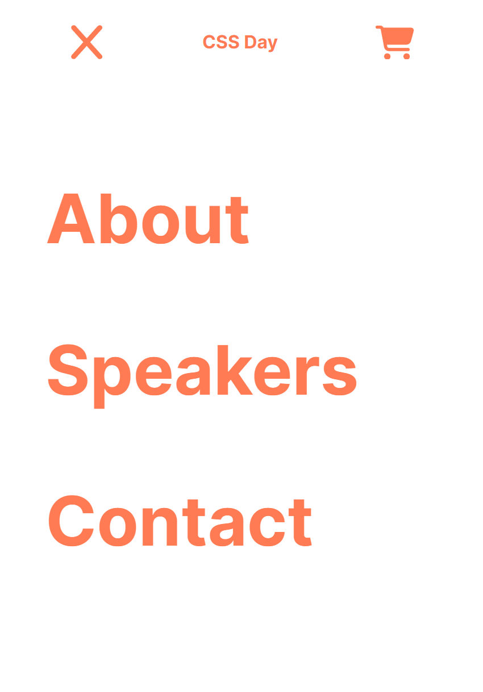
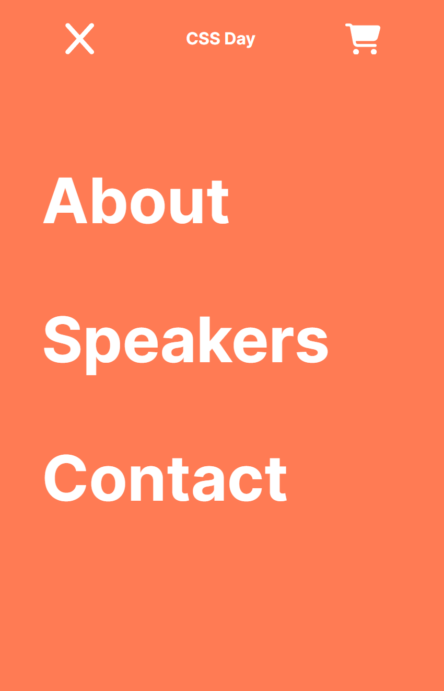

# CSS Day Website

  
Desktop Layout Index Page

  
  

  
Desktop Layout Speaker Page

  
  

  
Mobile Layout Index Page

  
  

  
Mobile Layout Speaker Page

  
  

  
Mobile Layout Hamburger Nav

  
  
  

> [!Note]
> Special thanks to Frontend Masters & Emma Bostian for [CSS Foundations](https://frontendmasters.com/courses/css-foundations/) Course for beginners.